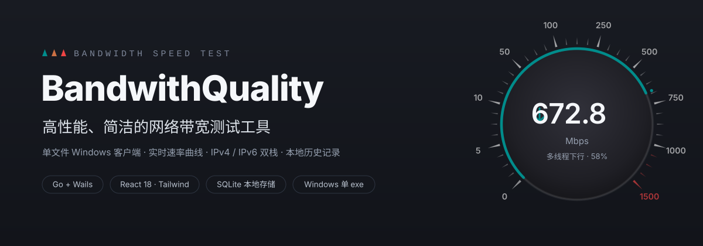
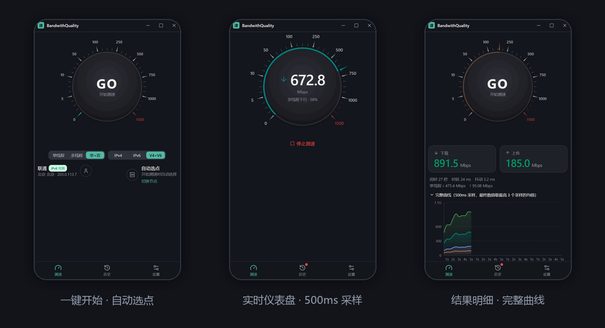
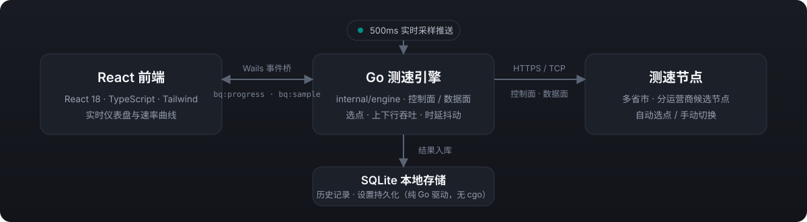

<p align="center">
  
</p>

# BandwithQuality

**高性能、简洁的网络带宽测试工具。** 单文件 Windows 桌面客户端：真实大陆节点一键测速、实时速率曲线、IPv4 / IPv6 双栈、本地历史对比。Go 引擎进程内运行，无运行时依赖，免安装开箱即用。

<p align="center">
  <a href="https://github.com/FoLeaf/BandwithQuality/releases"></a>
  
  
  
</p>

<p align="center">
  
</p>

## 特性

- **一键测速** — 出口探测自动选点（同运营商 + 同城优先，多级回退），点 **GO** 即测
- **实时仪表盘** — 500ms 采样逐 tick 推送，指针、刻度与速率曲线同步绘制
- **可持续口径** — 最终速率剔除最慢 30% 采样后取均值，贴近可持续带宽而非瞬时峰值
- **手动选点** — 分省市 / 运营商浏览真实节点列表，同城优先、节点延迟、支持搜索
- **IPv4 / IPv6 双栈** — 自动探测公网 IPv6 出口，命中后附加一轮 v6 测试，可随时关闭
- **历史与对比** — SQLite 本地存储，单次明细曲线、任意两次测速对比
- **克制的界面** — 9:16 竖屏窗口，深色仪表盘风格，底栏三页导航（测速 / 历史 / 设置）

## 快速开始

### 下载使用

从 [Releases](https://github.com/FoLeaf/BandwithQuality/releases) 下载最新的 Windows 安装包（`-setup.exe`）或免安装 zip，安装后打开点 **GO** 即可。

> 安装包未做代码签名：首次运行如遇 SmartScreen 提示，选择「更多信息 → 仍要运行」。

### 从源码构建

依赖：Go ≥ 1.26（wails v2.10 暂不兼容 1.27 的导出格式）、Node ≥ 20、[Wails CLI v2](https://wails.io/docs/gettingstarted/installation)。

```bash
git clone https://github.com/FoLeaf/BandwithQuality.git
cd BandwithQuality

wails dev        # 开发调试（可加 -browser 在浏览器里看）
wails build      # 产出 build/bin/BandwithQuality.exe
```

测试，以及无需 Go 后端的前端单独预览（模拟事件流）：

```bash
go test ./...

cd frontend && npm install && npm run dev
# 浏览器打开 http://localhost:5173/?mock=1
```

## 工作原理

<p align="center">
  
</p>

- **前端** React 18 + TypeScript + Tailwind + shadcn/ui，负责仪表盘、曲线与交互
- **引擎** `internal/engine` 三层分离：控制面（HTTPS 选点与排队）、数据面（TCP 流式下载 / 分块上传）、时延面（系统 ICMP ping，Windows 参数修正，失败自动回退 TCP 探测），纯 Go 无 cgo
- **事件桥** 引擎每 500ms 推一次采样，经 Wails 事件（`bq:progress` / `bq:sample` / `bq:finished`）直达前端，进程内直连、无子进程
- **存储** modernc.org/sqlite 纯 Go 驱动，历史与设置本地持久化

## 测速口径与高带宽建议

**默认参数**（新用户）：多线程、每阶段 13 秒（可调 5–13s）、下行 16 / 上行 8 连接、V4+V6 双栈。单地址族通常约 40 秒，双栈约 1–2 分钟（含探测与排队）。已保存的旧配置不会被覆盖。

**为什么叫可持续速率**：最终结果剔除最慢 30% 采样后取均值，比瞬时峰值更贴近可持续带宽，但不等于带宽保证；上传按本地 socket 成功写入的负载计数，不是远端确认字节数。

跑不满带宽时：

- 优先有线连接、同运营商就近节点；单个节点跑不满时换节点对照，别把远端限速当成瓶颈
- 再逐步加到 32 连接；更多连接不一定更快，以重复实测为准
- 双栈与更长阶段会增加时间与流量消耗
- 引擎用 256 KiB 传输块、独立连接计数，取消后等待旧连接退出，避免阶段间互相抢带宽
- 完整审查、回环基准与验证限制见[性能审查记录](docs/performance-review.md)

## 项目结构

```
main.go / app.go        Wails 壳与绑定层
internal/engine         测速引擎（控制面 / 数据面 / 时延 / 编排）
internal/store          SQLite 历史 + 设置持久化
frontend/               React 前端（shadcn/ui + recharts）
cmd/diag                节点连通性诊断小工具
```

## 平台支持

| 平台 | 状态 |
|---|---|
| Windows 10 / 11 | ✅ 提供安装包与免安装 zip |
| macOS / Linux | 同一代码库可编译，后续跟进 |

## 许可

本项目尚未附加开源许可证，默认保留所有权利，仅供个人学习与研究使用。
